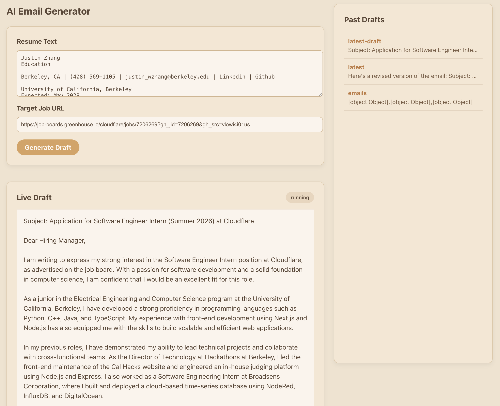

# cf_ai_email_workflow

AI-powered email draft assistant built on Cloudflare’s developer platform. Try it yourself: [https://cf_ai_jz.justinzhang20711.workers.dev](https://cf_ai_jz.justinzhang20711.workers.dev)

## Overview

`cf_ai_email_workflow` lets a user:

- Paste a resume and target job URL.
- Kick off a Cloudflare **Workflow** that:
  - Fetches the job description from the URL.
  - Calls **Workers AI** to generate a tailored, professional email draft.
  - Persists the latest draft and a history of drafts.
- Iteratively refine the draft by sending feedback; each feedback round produces a revised email via the same Workflow.
- View and load **past drafts** from history.

The app is a single-page React UI talking to a Workers backend over JSON routes.

## Tech Stack

### Frontend

- **React + TypeScript** SPA, built with **Vite**.
- Deployed as static assets under `frontend/dist` and served by the Worker using the `assets.directory` configuration in `wrangler.jsonc`.
- UI features:
  - Resume + job URL form.
  - Live draft panel with status chip.
  - Feedback box for incremental refinement.
  - Past drafts panel populated from Durable Object storage.

### Backend (Cloudflare)

- **Cloudflare Worker**
  - REST endpoints:
    - `POST /start` – create a new Workflow instance for a given resume and job URL.
    - `POST /feedback` – send a `user_feedback` event to an existing Workflow.
    - `GET /status` – query Workflow instance status.
    - `GET /get-latest-draft` – fetch the latest email draft text.
    - `GET /list-drafts` – fetch a JSON map of past drafts.
  - Typed `Env` bindings for:
    - `STATE`: Durable Object namespace.
    - `EMAIL_WORKFLOW`: Workflow binding.
    - `AI`: Workers AI binding.

- **Cloudflare Workflows** 
  - Durable, multi-step orchestration for:
    1. Fetching and slicing the job posting HTML.
    2. Generating an initial email using a Workers AI LLM.
    3. Persisting drafts via the Durable Object.
    4. Waiting for `user_feedback` events and revising the email until the user signals completion.
  - Makes use of `step.do` and `step.waitForEvent` to cleanly separate external calls and long-lived waits.

- **Durable Objects** 
  - Stores:
    - `"latest-draft"` – the most recent email.
    - Timestamped keys like `"draft:<ISO timestamp>"` – history entries with `{ draft, createdAt }`.
  - Exposes:
    - `POST /store-latest-draft` – update latest draft + append history.
    - `GET /get-latest-draft` – read latest draft.
    - `GET /list-drafts` – list all drafts as a JSON object for the UI.

- **Workers AI**
  - Uses a hosted LLM (e.g. `@cf/meta/llama-3.1-8b-instruct`) via `env.AI.run`.
  - Prompts:
    - Initial: “Write a short professional job application email. Job: … Resume: …”
    - Revision: “Revise this email based on this user feedback: …”
